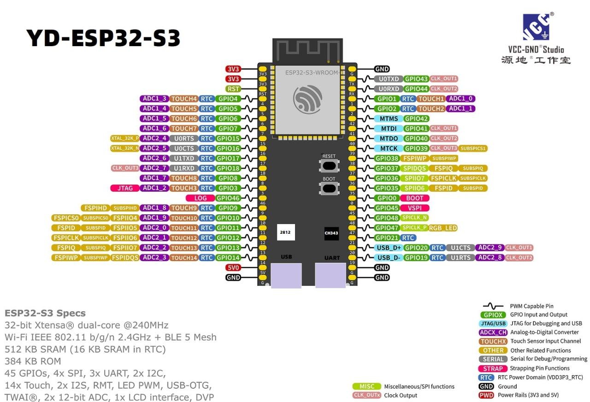

# esp32

## esp32-s3-wroom-1

## 語音模組

| Pin     | 功能                  | 說明                                      |
| ------- | ------------------- | --------------------------------------- |
| **VDD** | 電源正極                | 通常 3.3 V（部分型號支援 1.8V\~3.6V，要查資料表確認）     |
| **GND** | 地線                  | 電源與信號地                                  |
| **SD**  | Serial Data         | I²S 數據輸出（麥克風的音訊資料）                      |
| **WS**  | Word Select (LRCLK) | I²S 左/右聲道時脈，用於同步數據                      |
| **SCK** | Serial Clock (BCLK) | I²S 位元時脈，控制數據傳輸速率                       |
| **L/R** | Left/Right Select   | 選擇此麥克風輸出的聲道（接 GND=左聲道，接 VDD=右聲道，部分模組反之） |

## 可選喇叭模組（已獨立，預設停用）
- 模組原始檔已移至：`modules/speaker/speaker_manager.cpp`
- 標頭位於：`include/speaker_manager.h`
- 如需啟用：
  - 在 `src/main.cpp` 將 `#define ENABLE_SPEAKER 0` 改為 `1`
  - 並將 `modules/speaker/speaker_manager.cpp` 移回 `src/`，或調整 `platformio.ini` 讓該檔被編譯

## Quick Demo（本地最小步驟）

1) 啟動本地 MQTT Broker GUI
- `cd python`
- `python mqtt_broker_gui.py`

2) 啟動訊息監控 GUI 並訂閱
- `python mqtt_client_gui.py`
- 點擊快速按鈕：「ESP32」「特徵」「推論」「音訊」

3) 啟動特徵伺服器（接收特徵並回覆推論）
- `python feature_server.py`

4) 發送模擬特徵幀
- `python feature_simulator.py`
- （可選參數，PowerShell）
  - `$env:FRAMES=20; $env:BINS=64; $env:DEVICE_ID='esp32s3_lab1'; python feature_simulator.py`

主題（可於 `python/config.py` 調整）
- 特徵上傳：`esp32/feat/{device}/{session}/{idx}`
- 推論回覆：`esp32/infer/{device}`
- 音訊分塊：`esp32/audio/{timestamp}/{chunk}`
